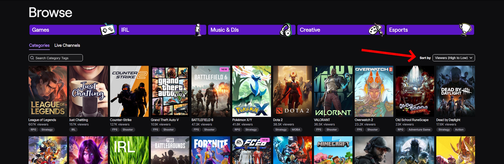
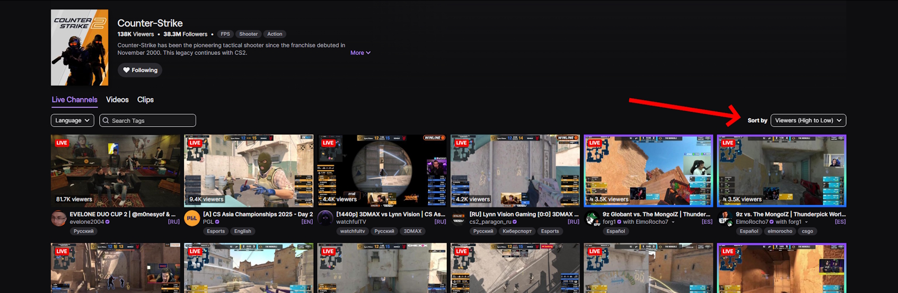

<h1 align="center">
Twitch - Force sort Viewers High to Low
</h1>

Userscript for browsers that automatically sets the Twitch directory sort option to **“Viewers (High to Low)”**.  
Works on `/directory`, `/directory/all`, and other Twitch pages with the same sort dropdown.

## ✨ Features
- Forces sorting by *Viewers (High to Low)* on Twitch directory pages.
- Works across SPA navigations (React router) and on initial load.
- Works with all languages.
- Two configurable run policies:
  - **perTab** — applies once per URL within the current tab. If you manually change the sort option, the script won’t override it again (even after F5).
  - **perLoad** — applies once per URL on each page load. Refreshing with F5 will re-apply the sort.

## 🖼 Screenshots

<br>


## 🔧 Installation
1. Install [Tampermonkey](https://www.tampermonkey.net/) (or another userscript manager).
2. Install the script from one of the mirrors:
   - [GreasyFork](https://greasyfork.org/en/scripts/549727-twitch-force-sort-viewers-high-to-low)
   - [OpenUserJS](https://openuserjs.org/scripts/Vikindor/Twitch_-_Force_sort_Viewers_High_to_Low)
   - Or [install directly from this repository](./Twitch_-_Force_sort_Viewers_High_to_Low.js).

## ⚙️ Configuration
Open the script in your userscript manager and change the value of:

```js
const RUN_POLICY = 'perTab'; // or 'perLoad'
```

perTab — recommended for users who want to change sorting manually without interference.

perLoad — recommended for users who always want sorting reset on refresh.